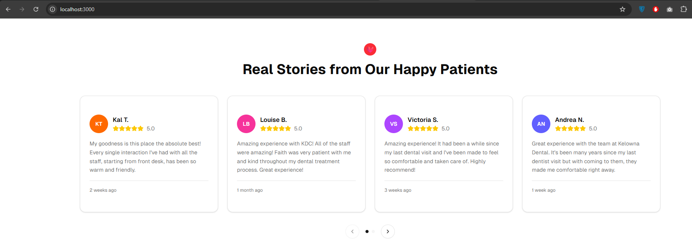

# ReactJS Dynamic Review Carousel

## Project Overview
This Next.js project implements a dynamic, responsive carousel component that fetches and displays user reviews in real-time. It adapts smoothly to different screen sizes and provides intuitive navigation controls.

## Features
- Real-time fetching of reviews from API or mock data
- Responsive design adjusting visible reviews by device
- Navigation with next/previous buttons and pagination dots
- Star rating visualization for reviews
- Loading, error handling, and empty state UI

## Getting Started

### Prerequisites
- Node.js (>= 16.x)
- npm or yarn

### Installation
npm install
or
yarn install

### Running the Development Server
npm run dev
or
yarn dev

Open [http://localhost:3000](http://localhost:3000) to view in browser.

## Usage
- Use the `<ReviewsCarousel placeId="YOUR_PLACE_ID" />` component anywhere in your app to show reviews for a specific place.
- Replace mock data fetching with real API endpoints as needed.

## Environment Variables
- `NEXT_PUBLIC_GOOGLE_PLACES_API_KEY`: API key for Google Places reviews fetching.

## Technologies
- Next.js 13 (App Router)
- React 18+
- Tailwind CSS for styling
- TypeScript for type safety
- Lucide-react for icons

## Contributing
Feel free to open issues or submit pull requests to improve the carousel or add features.

## License
MIT License
